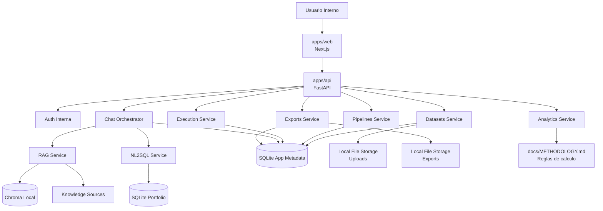
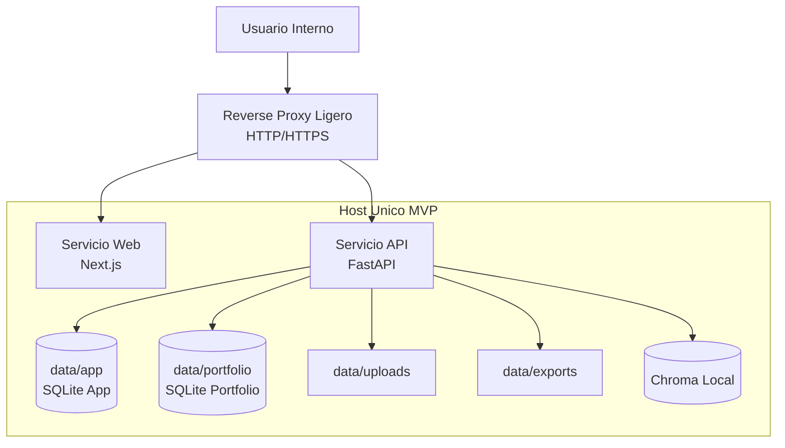

# DDR

## 1. Proposito

Este documento define el diseno arquitectonico del MVP de la plataforma no-code de analitica de riesgo crediticio.

Su objetivo es traducir `docs/SPEC.md` en una arquitectura implementable, explicando decisiones de diseno, limites operativos, trade-offs, riesgos tecnicos y camino de evolucion.

Este documento debe leerse junto con:

- `docs/PRD.md`
- `docs/SPEC.md`
- `docs/METHODOLOGY.md`

Si existe conflicto entre este documento y las reglas metodologicas de calculo de cosechas, prevalece `docs/METHODOLOGY.md`.

## 2. Alcance

Este DDR cubre la arquitectura del MVP para las siguientes capacidades:

- canvas visual para pipelines simples
- ejecucion secuencial de pipelines
- nodos de preparacion basica
- nodo de cosechas de mora
- nodo de cosechas de default
- visualizacion de resultados
- exportacion PDF y PPT
- chat IA para ayuda contextual, interpretacion y consulta de portafolio
- persistencia de datasets, pipelines, ejecuciones, sesiones y exportaciones

Este DDR no cubre en detalle:

- arquitectura multi-tenant
- colaboracion multiusuario en tiempo real
- alta disponibilidad o despliegue distribuido
- conectores empresariales adicionales
- arquitectura post-MVP a nivel de implementacion detallada

## 3. Contexto del Sistema

El sistema es una aplicacion web interna orientada a usuarios de riesgo y negocio que necesitan construir y ejecutar analisis sin programar.

El flujo principal del MVP es:

1. El usuario carga o selecciona un dataset.
2. El usuario construye un pipeline en un canvas visual.
3. El usuario configura nodos de preparacion y analisis.
4. El backend valida y ejecuta el pipeline de forma secuencial.
5. El sistema muestra tablas, metricas y visualizaciones.
6. El usuario exporta resultados o interactua con el chat para interpretar o consultar informacion.

El piloto esta dirigido a una sola area interna especifica. No existe requerimiento de aislamiento por tenant en el MVP.

## 4. Resumen de Requisitos

### 4.1 Funcionales

Los requisitos funcionales con mayor impacto arquitectonico son:

- crear, editar, guardar, validar y ejecutar pipelines visuales simples
- cargar CSV y Excel, y registrar datasets precargados
- ejecutar nodos de preparacion sobre datasets tabulares
- ejecutar dos nodos analiticos diferenciados: mora y default
- inspeccionar datos intermedios y propagar selecciones
- persistir trazabilidad de ejecuciones y errores por nodo
- exportar resultados a PDF y PPT
- soportar chat IA en tres modos explicitos:
  - `product_help`
  - `result_interpretation`
  - `portfolio_query`
- consultar la base del portafolio en modo solo lectura sin exponer SQL al usuario final

### 4.2 No Funcionales

Los NFR del MVP se expresan de forma cualitativa para no sobredeterminar un piloto temprano:

- performance suficiente para una experiencia fluida en un piloto interno con datasets pequenos y medianos
- disponibilidad suficiente para operacion interna sin objetivos de alta disponibilidad
- seguridad basada en acceso autenticado, secretos confinados al backend y restriccion fuerte del chat SQL
- trazabilidad suficiente para auditar ejecuciones, consultas y exportaciones
- mantenibilidad basada en modulos claros y separacion entre producto y prototipos
- operabilidad simple sobre una sola maquina con observabilidad basica
- escalabilidad evolutiva, permitiendo crecer sin redisenar completamente la solucion

### 4.3 Restricciones Cerradas

- frontend principal: `Next.js`
- backend principal: `FastAPI`
- lenguaje backend: `Python`
- fuente principal del portafolio en MVP: `SQLite`
- almacenamiento de archivos en disco local durante el MVP
- despliegue del MVP en una sola maquina
- autenticacion interna con usuario y contrasena
- `mode` de chat enviado explicitamente por el cliente

## 5. Drivers Arquitectonicos

Los drivers que gobiernan este diseno son:

- minimizar complejidad operativa para acelerar el MVP
- mantener flujos criticos deterministas: ejecucion, calculo y exportacion
- separar claramente producto de prototipos de referencia
- permitir trazabilidad completa por dataset, pipeline, ejecucion, nodo y chat
- preservar seguridad y control sobre consultas al portafolio
- permitir una evolucion gradual hacia una arquitectura mas robusta post-MVP

## 6. Restricciones y Supuestos

Se asumen las siguientes condiciones para el MVP:

- una sola maquina hospeda la solucion completa
- `apps/web` y `apps/api` estan separados logicamente, pero coexisten en el mismo host
- los usuarios pertenecen a una sola area interna del piloto
- no existe multi-tenant
- los archivos `uploads` y `exports` pueden mantenerse en disco local
- `Chroma` se ejecuta localmente para soportar RAG
- no se requiere streaming de respuestas del chat como condicion inicial
- no se requiere infraestructura de colas distribuidas en esta etapa

## 7. Decision de Patron Arquitectonico

### 7.1 Decision

Se adopta una arquitectura de tipo **modular monolith** para `apps/api`, con una aplicacion frontend `Next.js` separada.

### 7.2 Razonamiento

Esta decision prioriza:

- simplicidad de despliegue y operacion
- velocidad de implementacion del MVP
- menor costo de coordinacion para un dominio aun en formacion
- facilidad para trabajar con `SQLite`, filesystem local y runner secuencial

### 7.3 Alternativas Consideradas

#### Microservices

No se elige por:

- complejidad operacional innecesaria para el piloto
- sobrecarga de observabilidad, redes, contratos y despliegue
- ausencia de una necesidad real de escalado independiente por dominio en esta etapa

#### Event-driven desde el inicio

No se elige por:

- mayor complejidad para debugging y trazabilidad temprana
- poca ganancia en un flujo principalmente secuencial y determinista
- costo adicional de introducir bus de eventos o colas distribuidas antes de validar el producto

#### Serverless

No se elige por:

- menor control sobre filesystem local y procesos largos del MVP
- complejidad adicional para empaquetar dependencias analiticas, RAG y exportacion
- peor ajuste a una solucion desplegada en una sola maquina

### 7.4 Trade-offs

- se gana simplicidad y velocidad de entrega a cambio de menor escalado independiente por componente
- se acepta un unico punto de falla en el host del MVP a cambio de menor costo operacional
- se privilegia claridad de flujo sobre elasticidad avanzada

## 8. Arquitectura Logica

La solucion se divide en dos aplicaciones principales:

- `apps/web`: interfaz `Next.js`
- `apps/api`: backend `FastAPI`

Dentro de `apps/api`, el sistema se organiza en modulos de dominio y soporte:

- `datasets`
- `pipelines`
- `execution`
- `analytics`
- `chat`
- `rag`
- `text2sql`
- `exports`
- `repositories` y `models`

### 8.1 Responsabilidades por Componente

#### Frontend `apps/web`

- renderizar el canvas y paneles asociados
- capturar configuracion de nodos y conexiones
- mostrar resultados tabulares y graficos
- mantener historial y modo explicito del chat
- iniciar ejecuciones, consultar estado y disparar exportaciones

#### Backend `apps/api`

- exponer API REST del producto
- autenticar usuarios
- validar estructuras y configuraciones de pipelines
- ejecutar pipelines secuencialmente
- persistir metadatos y trazabilidad
- encapsular integracion con LLM, RAG y NL2SQL
- generar artefactos PDF y PPT

#### Datos y almacenamiento

- `SQLite` de portafolio para consultas del negocio
- `SQLite` de aplicacion para metadatos y trazabilidad
- filesystem local para `uploads` y `exports`
- `Chroma` local para embeddings y recuperacion documental

## 9. Diagrama Logico

## 10. Arquitectura de Despliegue

El MVP se despliega en una sola maquina. Esto reduce complejidad de infraestructura, pero impone limites claros en disponibilidad, resiliencia y concurrencia.

### 10.1 Caracteristicas del Despliegue

- un host unico soporta frontend, backend y stores locales
- el acceso externo de usuarios se concentra en un unico punto de entrada del host
- `web` y `api` se ejecutan como procesos o servicios separados sobre la misma maquina
- ambas bases `SQLite` viven localmente en el host
- `Chroma` y los archivos del sistema viven localmente en el host

### 10.2 Implicaciones Operativas

- el host es un punto unico de falla
- el almacenamiento depende de disco local
- la concurrencia total debe mantenerse acotada para no tensionar `SQLite`
- el backup y la recuperacion deben cubrir bases y artefactos exportados
- un reverse proxy ligero agrega una pieza operativa adicional, pero reduce exposicion directa de procesos internos

### 10.3 Boundary de Red y Exposicion de Servicios

El acceso de usuarios internos al MVP debe realizarse a traves de un unico punto de entrada HTTP/HTTPS en el host.

Para ello, se asume un reverse proxy ligero en la misma maquina, encargado de:

- publicar la aplicacion web
- enrutar solicitudes API hacia `apps/api`
- centralizar la terminacion TLS cuando aplique
- reducir la exposicion directa de procesos internos

Bajo este esquema:

- `apps/web` y `apps/api` se exponen a traves del proxy
- `SQLite` de aplicacion, `SQLite` de portafolio, `Chroma` y el filesystem local no deben exponerse por red
- los componentes de datos y soporte deben permanecer accesibles solo desde el propio host

Esta decision reduce la superficie expuesta del sistema sin introducir complejidad de una topologia distribuida.

## 11. Diagrama de Despliegue

## 12. Diseno del Frontend

El frontend se implementa en `Next.js` con App Router y concentra la experiencia de usuario del canvas, resultados y chat.

### 12.1 Responsabilidades

- renderizar el canvas visual y la libreria de nodos
- permitir configuracion visual de nodos y conexiones
- mostrar validaciones basicas de compatibilidad
- disparar validacion y ejecucion de pipelines
- visualizar estados por nodo: `idle`, `configured`, `running`, `success`, `error`
- mostrar tablas, graficos y metricas
- presentar chat persistente con selector de modo
- soportar guardado y reapertura de pipelines

### 12.2 Decisiones de Diseno

- usar una libreria tipo React Flow o equivalente para el canvas
- mantener el `graph_json` como representacion canonica del workflow
- enviar el `mode` del chat de forma explicita, evitando inferencia automatica en backend
- concentrar en backend la logica sensible: ejecucion, SQL, guardrails, RAG y exportacion

## 13. Diseno del Backend

`FastAPI` actua como punto unico de entrada del sistema.

### 13.1 Responsabilidades

- autenticacion y control de acceso del MVP
- validacion de requests y contratos
- persistencia de metadatos
- orquestacion de ejecucion de pipelines
- encapsulacion de logica analitica
- orquestacion del subsistema de chat
- generacion de exportaciones

### 13.2 Modulos Internos

- `services/datasets`: registro, preview, mapping y materializacion cuando aplique
- `services/pipelines`: CRUD, validacion y persistencia de workflows
- `services/execution`: orden topologico, ejecucion, snapshots y estados
- `services/analytics`: implementacion de nodos de cosechas y preparacion relacionada
- `services/chat`: orquestacion de modos, contexto y respuestas
- `services/rag`: recuperacion documental y apoyo a interpretacion
- `services/text2sql`: generacion y validacion de SQL en modo lectura
- `services/exports`: generacion de PDF y PPT a partir de resultados persistidos

### 13.3 Principio de Integracion con Prototipos

Los contenidos bajo `agents/` se toman como referencia funcional y metodologica, no como servicios listos para produccion. El backend debe reimplementar comportamiento estable y controlado, sin acoplarse al runtime experimental de esos prototipos.

## 14. Persistencia y Almacenamiento

### 14.1 `SQLite` de Portafolio

Su funcion es servir como fuente consultable para el modo `portfolio_query` del chat.

Decisiones relevantes:

- acceso solo lectura desde el flujo NL2SQL
- catalogo explicito de tablas permitidas
- limite de filas y timeout de consulta

### 14.2 `SQLite` de Aplicacion

Su funcion es persistir los metadatos y la trazabilidad del producto.

Debe almacenar, como minimo:

- usuarios internos autenticables
- datasets registrados
- pipelines
- ejecuciones
- ejecuciones por nodo
- snapshots de seleccion
- sesiones y mensajes de chat
- jobs de exportacion

### 14.3 Filesystem Local

Se utiliza para:

- archivos de carga en `data/uploads/`
- archivos exportados en `data/exports/`
- posibles artefactos temporales de procesamiento del MVP

Esta decision simplifica la operacion inicial, pero introduce dependencia directa del host local.

### 14.4 `Chroma`

`Chroma` se utiliza como store vectorial local para el subsistema RAG, siguiendo la referencia funcional de `agents/rag`.

## 15. Modelo de Datos y Trazabilidad

El modelo de dominio base definido en `docs/SPEC.md` se preserva como contrato principal del MVP.

### 15.1 Entidades Clave

- `User`
- `Dataset`
- `Pipeline`
- `PipelineNode`
- `PipelineEdge`
- `Execution`
- `NodeExecution`
- `SelectionSnapshot`
- `ChatSession`
- `ChatMessage`
- `ExportJob`

### 15.2 Principios de Trazabilidad

- `graph_json` es la fuente canonica del workflow
- la identidad autenticada debe poder vincularse con sesiones de chat y registrarse en la trazabilidad operativa de ejecuciones y exportaciones
- cada ejecucion debe vincularse con su pipeline y dataset
- cada nodo ejecutado debe registrar estado, tiempos y snapshots
- las consultas de chat deben poder vincularse con la sesion y el contexto funcional
- las exportaciones deben poder rastrearse hasta la ejecucion origen

## 16. Diseno del Motor de Ejecucion

El motor de ejecucion es secuencial y determinista para el MVP.

### 16.1 Flujo Base

1. El frontend solicita la ejecucion del pipeline.
2. El backend registra `Execution` y devuelve `execution_id`.
3. El runner local toma la ejecucion pendiente.
4. El backend valida estructura y configuracion.
5. El backend construye un orden topologico.
6. El backend ejecuta nodo por nodo.
7. El backend persiste salidas referenciadas y estados intermedios.
8. Si ocurre un error, la ejecucion se detiene y se registra el fallo.
9. Si finaliza correctamente, se persiste `result_json` consolidado.

### 16.2 Validaciones Previas

- grafo aciclico
- presencia de nodos de entrada y salida
- un solo dataset fuente por ejecucion en MVP
- configuraciones requeridas presentes
- columnas logicas correctamente mapeadas
- compatibilidad de tipos entre nodos

### 16.3 Trade-offs

- la ejecucion secuencial simplifica depuracion y trazabilidad
- se reduce el acoplamiento al ciclo de vida del request HTTP
- no se optimiza el throughput maximo de ejecuciones concurrentes
- se mantiene dependencia directa del proceso y del host local
- no existe recuperacion automatica de ejecuciones en curso
- se deja abierta la evolucion futura hacia jobs asincronicos mas robustos

### 16.4 Runner MVP

El MVP utilizara un runner local liviano para desacoplar la ejecucion del ciclo de vida del request HTTP sin introducir una infraestructura de colas distribuida.

El flujo esperado es:

1. El cliente solicita la ejecucion del pipeline.
2. El backend crea el registro `Execution` con estado inicial.
3. El backend devuelve de forma inmediata un `execution_id`.
4. La ejecucion real se procesa en background dentro del entorno local del backend.
5. El frontend consulta el estado mediante polling sobre los endpoints de ejecucion.
6. El backend actualiza estados de `Execution` y `NodeExecution` conforme avanza el procesamiento.

Este enfoque mantiene la simplicidad operativa del MVP, reduce riesgo de timeouts HTTP y conserva una ruta clara de evolucion hacia un mecanismo asincronico mas robusto en etapas posteriores.

Si el proceso del backend o el host se interrumpe durante una ejecucion en curso, el MVP no intentara reanudar automaticamente el trabajo. La recuperacion sera manual mediante una nueva ejecucion iniciada por el usuario o por operacion tecnica.

## 17. Diseno de Nodos Analiticos

El MVP modela explicitamente dos nodos analiticos distintos:

- `vintage_delinquency_analysis`
- `vintage_default_analysis`

### 17.1 Principios

- ambos nodos operan sobre datasets tabulares validados
- las columnas fisicas deben mapearse a columnas logicas requeridas
- las reglas de calculo obligatorias viven en `docs/METHODOLOGY.md`
- la salida debe ser estructurada y reutilizable por frontend, exportacion y chat

### 17.2 Output Estandar

Cada nodo analitico debe producir:

- tabla agregada
- metricas resumen
- serie lista para grafico
- narrativa corta para interpretacion posterior en chat

## 18. Diseno del Subsistema de Chat

El chat se implementa como un subsistema orquestado desde backend con tres modos explicitos.

### 18.1 `product_help`

Usa contexto de pantalla, pipeline y errores para:

- explicar nodos
- orientar configuraciones
- explicar fallas
- sugerir siguiente paso

El modo `product_help` debe priorizar contexto estructurado del sistema por encima de recuperacion documental, de manera que pueda seguir operando aun cuando el subsistema RAG no este disponible.

### 18.2 `result_interpretation`

Usa:

- `execution.result_json`
- contexto analitico
- referencias de dominio recuperadas via RAG

Su objetivo es resumir hallazgos y sugerir interpretaciones de negocio sin alterar resultados deterministas del pipeline.

El modo `result_interpretation` no recalcula resultados ni sustituye la salida determinista del pipeline. Su funcion es interpretar `execution.result_json` y enriquecer la explicacion con contexto documental recuperado por RAG cuando este disponible.

### 18.3 `portfolio_query`

Usa NL2SQL sobre la base `SQLite` del portafolio.

Su objetivo es responder preguntas del negocio mostrando solo el resultado final y preservando trazabilidad tecnica interna.

El modo `portfolio_query` se limita a consultas estructuradas de solo lectura sobre tablas habilitadas del portafolio. La respuesta final puede ser expresada en lenguaje natural, pero la ejecucion subyacente permanece restringida por guardrails tecnicos definidos por backend.

### 18.4 Principios de Diseno

- el backend centraliza prompts, guardrails y acceso a datos
- el frontend solo envia `mode`, mensaje y contexto funcional
- SQL, prompts internos y razonamiento intermedio no se exponen al usuario

### 18.5 Dependencias Tecnicas por Modo

- `product_help`
  - depende principalmente de contexto estructurado del producto:
    - pantalla actual
    - pipeline
    - configuracion de nodos
    - errores de ejecucion
  - puede enriquecerse con RAG, pero no debe depender exclusivamente de el
- `result_interpretation`
  - depende de:
    - `execution.result_json`
    - contexto analitico estructurado
    - RAG como soporte de interpretacion y recomendaciones
  - es el modo mas dependiente de `Chroma`
- `portfolio_query`
  - depende de:
    - `NL2SQL`
    - esquema y tablas permitidas
    - `SQLite` de portafolio
  - no depende de `Chroma`

La trazabilidad del chat debe conservar el modo utilizado, el contexto funcional asociado y la metadata tecnica necesaria para auditoria, sin exponer al usuario SQL, prompts internos ni razonamiento intermedio.

## 19. Guardrails del Chat SQL

Las consultas del modo `portfolio_query` se rigen por las siguientes restricciones:

Restricciones tecnicas:

- solo `SELECT`
- ejecucion en modo lectura
- timeout de ejecucion
- limite de filas configurable
- sanitizacion y validacion previa del SQL

Restricciones de acceso y dominio:

- prohibido `INSERT`, `UPDATE`, `DELETE`, `DROP`, `ALTER`
- lista blanca de tablas consultables
- no exposicion de SQL al usuario final
- registro interno del SQL para auditoria tecnica, no para UI

Este diseno privilegia seguridad y control sobre flexibilidad total del lenguaje natural.

## 20. Seguridad y Control de Acceso

### 20.1 Decision

El MVP implementa autenticacion interna con usuario y contrasena.

### 20.2 Alcance de Seguridad del MVP

- acceso autenticado obligatorio
- posible autorizacion simple por rol si se requiere distinguir perfiles internos
- secrets y credenciales solo en backend
- no exponer llaves, rutas sensibles ni SQL al frontend
- no registrar datos sensibles innecesarios en logs

### 20.3 Trade-offs

- se prioriza una solucion interna simple sobre integracion temprana con SSO corporativo
- se acepta una estrategia de acceso minima mientras el piloto permanezca acotado a una sola area interna

### 20.4 Modelo Minimo de Identidad

El MVP utilizara un modelo de identidad interno y acotado, suficiente para controlar acceso y sostener trazabilidad basica del sistema.

Este modelo asume:

- una entidad `User` persistida en la base `SQLite` de aplicacion
- almacenamiento de contrasenas mediante hash seguro, nunca en texto plano
- autenticacion resuelta por el backend
- asociacion del usuario autenticado con las sesiones de chat y con la trazabilidad operativa de ejecuciones y exportaciones cuando aplique

Este enfoque prioriza simplicidad operativa y control interno sobre integraciones externas de identidad en la etapa MVP.

### 20.5 Sesion y Contexto Autenticado

Para el MVP, la sesion autenticada se gestionara desde backend y se materializara mediante cookie segura y `HTTP-only`, adecuada para una aplicacion web interna.

Bajo este esquema:

- el frontend no administra tokens persistentes de aplicacion fuera del flujo de login
- el backend valida la sesion en cada request autenticado
- `ChatSession.user_id` referencia al usuario autenticado
- la identidad autenticada debe registrarse en logs y metadata operativa de las acciones auditables, incluyendo ejecuciones y exportaciones

Esta decision reduce la exposicion de credenciales o tokens en el cliente y simplifica el modelo de acceso del MVP.

La autorizacion del MVP podra mantenerse simple. Si surge necesidad operativa de distinguir permisos, se podra introducir un esquema minimo de roles internos, por ejemplo `admin` y `analyst`, sin convertir esta capacidad en un requisito estructural del MVP.

## 21. Observabilidad y Logging

La observabilidad del MVP debe ser suficiente para soporte operativo, auditoria basica y troubleshooting.

### 21.1 Logs Minimos

- log por request API
- log por ejecucion de pipeline
- log por nodo
- log por consulta de chat
- log de exportacion

### 21.2 Correlacion

Cada log critico debe incluir, cuando aplique:

- `request_id`
- `pipeline_id`
- `execution_id`
- `chat_session_id`
- `status`
- `duration_ms`

### 21.3 Alcance

No se requiere en MVP una plataforma de observabilidad distribuida completa. El objetivo es contar con evidencia operativa suficiente para diagnosticar errores y reconstruir el contexto de una ejecucion o consulta.

## 22. Recomendaciones Tecnologicas

### 22.1 Frontend

- `Next.js` por consistencia con la `SPEC`, buen soporte para App Router y ecosistema maduro para aplicaciones web internas
- libreria tipo React Flow para modelado visual del canvas

### 22.2 Backend

- `FastAPI` por productividad en Python, tipado claro y buen ajuste a APIs delgadas con servicios de dominio
- `Python` por cercania natural con la logica analitica, RAG y NL2SQL

### 22.3 Datos

- `SQLite` para portafolio MVP y metadatos por simplicidad operacional y bajo costo
- `Chroma` local para RAG siguiendo el prototipo existente

### 22.4 Exportacion

- PDF server-side desde HTML o templates estructurados
- PPT server-side con `python-pptx`

## 23. Riesgos Tecnicos y Mitigaciones

### 23.1 Politica Minima de Respaldo y Recuperacion

Dado que el MVP se despliega en un host unico y depende de almacenamiento local, la estrategia minima de respaldo y recuperacion debe cubrir los activos necesarios para restaurar operacion y trazabilidad basica.

Deben considerarse activos de respaldo obligatorio:

- la base `SQLite` de aplicacion
- la base `SQLite` de portafolio
- `data/uploads/`
- `data/exports/`

`Chroma` podra tratarse como artefacto regenerable siempre que las fuentes documentales de conocimiento permanezcan controladas y disponibles para reconstruccion.

La restauracion en el MVP podra ser manual y no requiere failover automatico. Esta decision es consistente con el alcance de un piloto interno de baja complejidad operacional.

| Riesgo | Impacto | Mitigacion |
|---|---|---|
| Limites de concurrencia de `SQLite` | bloqueos o degradacion bajo mayor actividad | mantener piloto pequeno, controlar writes y evaluar migracion futura |
| Host unico | punto unico de falla | backups de bases y filesystem critico, restauracion manual y procedimientos operativos simples |
| Filesystem local | perdida de uploads o exports | backup de uploads/exports, limpieza controlada y regeneracion de artefactos cuando aplique |
| Prototipos en `agents/` no productivos | deuda tecnica de integracion | reimplementar comportamiento estable dentro de `apps/api` |
| Variabilidad del LLM | respuestas inconsistentes | guardrails, modo explicito y post-procesamiento acotado |
| Exportacion PDF/PPT | complejidad de templates | limitar formatos iniciales y estructura fija |

## 24. Failure Modes y Respuesta Esperada

| Failure mode | Impacto esperado | Respuesta arquitectonica |
|---|---|---|
| Falla de nodo en pipeline | ejecucion incompleta | detener flujo, registrar `NodeExecution`, exponer error entendible |
| SQL invalido o no permitido | consulta de chat fallida | bloquear ejecucion, registrar intento y devolver respuesta controlada |
| Caida del proceso API o del runner durante una ejecucion | ejecucion interrumpida y estado inconsistente o incompleto | no reanudar automaticamente; marcar ejecucion fallida o recuperable segun implementacion y requerir reejecucion manual |
| Caida de `Chroma` o fallo de recuperacion | degradacion de `result_interpretation` y de ayuda enriquecida | responder con capacidad reducida, sin bloquear ejecucion de pipelines ni consultas `portfolio_query` |
| Caida del host | indisponibilidad total | restauracion del entorno desde backups cuando corresponda; las ejecuciones en curso no se reanudan automaticamente y requieren reejecucion manual |
| Corrupcion de archivo local | perdida parcial de artefactos | restauracion desde backup o regeneracion si aplica |

No todos los artefactos locales tienen el mismo valor operativo. Las bases `SQLite`, los archivos fuente del piloto y los exports persistidos deben tratarse como activos criticos. En cambio, ciertos artefactos derivados tecnicos, como indices regenerables de `Chroma`, pueden recuperarse por reconstruccion segun el caso.

En el MVP no se contempla recuperacion automatica de ejecuciones en curso ni failover de infraestructura. La estrategia de respuesta privilegia deteccion clara del fallo, preservacion de trazabilidad y recuperacion manual controlada.

## 25. Evolucion Post-MVP

La arquitectura propuesta deja preparados los siguientes caminos de evolucion:

- mover `uploads` y `exports` a storage externo
- sustituir `SQLite` por una base mas robusta si crecen concurrencia o volumen
- introducir un runner asincronico mas robusto para ejecuciones largas
- incorporar SSO corporativo
- separar fisicamente `web` y `api` en despliegues independientes
- ampliar autorizacion y controles de acceso
- fortalecer observabilidad con metricas y alertas mas avanzadas

## 26. Lista de ADRs Planeados

Las siguientes decisiones deben formalizarse despues como ADRs separados:

1. `ADR-001`: Adoptar arquitectura `modular monolith` para el backend MVP.
2. `ADR-002`: Separar `apps/web` y `apps/api` con despliegue conjunto en una sola maquina.
3. `ADR-003`: Usar `SQLite` separado para portafolio y metadatos de aplicacion.
4. `ADR-004`: Usar almacenamiento local para `uploads` y `exports` durante el MVP.
5. `ADR-005`: Ejecutar pipelines con runner secuencial liviano.
6. `ADR-006`: Centralizar las integraciones LLM en el backend.
7. `ADR-007`: Separar funcionalmente `RAG` y `NL2SQL` como rutas distintas del chat.
8. `ADR-008`: Implementar autenticacion interna con usuario y contrasena.
9. `ADR-009`: Restringir el chat SQL a consultas de solo lectura con guardrails.
10. `ADR-010`: Persistir trazabilidad de datasets, ejecuciones, chat y exportaciones.
11. `ADR-011`: Mantener `mode` de chat explicito en cliente para el MVP.
12. `ADR-012`: Disenar el backend para evolucion futura a ejecucion asincronica mas robusta.

## 27. Revision con Stakeholders

Antes de considerar este DDR final, se debe revisar con stakeholders tecnicos y de producto al menos estos puntos:

- validez del patron `modular monolith` para el MVP
- aceptacion de despliegue en host unico
- aceptacion de autenticacion interna simple
- aceptacion de limites operativos de `SQLite` y filesystem local
- prioridad real de evolucion post-MVP

Si esa revision cambia supuestos de seguridad, volumen, concurrencia o despliegue, este DDR debe actualizarse antes de redactar los ADR definitivos.

## 28. Referencias

- `docs/PRD.md`
- `docs/SPEC.md`
- `docs/METHODOLOGY.md`
- `agents/text2sql`
- `agents/rag`
- `github/orange3`
